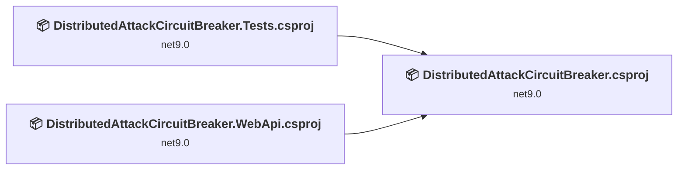
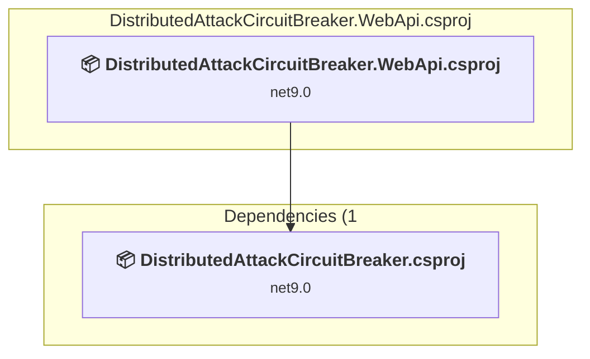
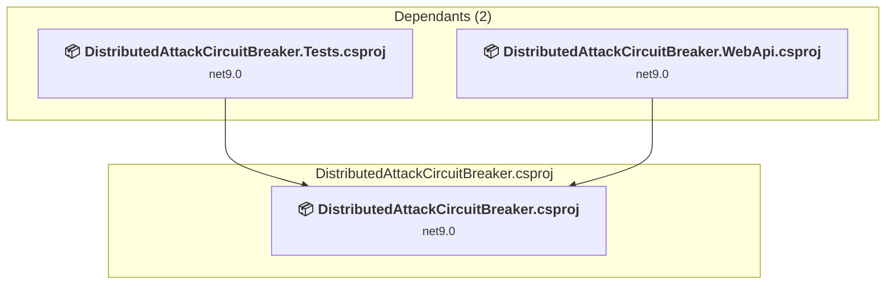
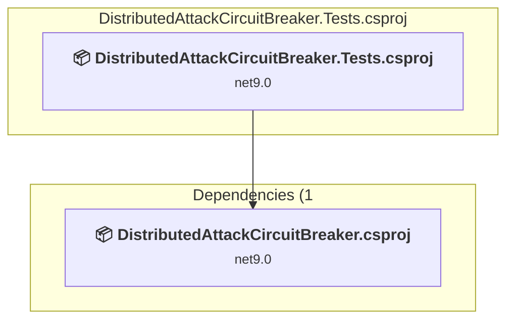

# Projects and dependencies analysis

This document provides a comprehensive overview of the projects and their dependencies in the context of upgrading to .NETCoreApp,Version=v10.0.

## Table of Contents

- [Executive Summary](#executive-Summary)
  - [Highlevel Metrics](#highlevel-metrics)
  - [Projects Compatibility](#projects-compatibility)
  - [Package Compatibility](#package-compatibility)
  - [API Compatibility](#api-compatibility)
  - [Binding Redirect Configuration](#binding-redirect-configuration)
- [Aggregate NuGet packages details](#aggregate-nuget-packages-details)
- [Top API Migration Challenges](#top-api-migration-challenges)
  - [Technologies and Features](#technologies-and-features)
  - [Most Frequent API Issues](#most-frequent-api-issues)
- [Projects Relationship Graph](#projects-relationship-graph)
- [Project Details](#project-details)

  - [src\DistributedAttackCircuitBreaker.WebApi\DistributedAttackCircuitBreaker.WebApi.csproj](#srcdistributedattackcircuitbreakerwebapidistributedattackcircuitbreakerwebapicsproj)
  - [src\DistributedAttackCircuitBreaker\DistributedAttackCircuitBreaker.csproj](#srcdistributedattackcircuitbreakerdistributedattackcircuitbreakercsproj)
  - [tests\DistributedAttackCircuitBreaker.Tests\DistributedAttackCircuitBreaker.Tests.csproj](#testsdistributedattackcircuitbreakertestsdistributedattackcircuitbreakertestscsproj)

## Executive Summary

### Highlevel Metrics

| Metric | Count | Status |
| :--- | :---: | :--- |
| Total Projects | 3 | All require upgrade |
| Total NuGet Packages | 37 | 5 need upgrade |
| Total Code Files | 10 |  |
| Total Code Files with Incidents | 3 |  |
| Total Lines of Code | 676 |  |
| Total Number of Issues | 8 |  |
| Estimated LOC to modify | 0+ | at least 0,0% of codebase |

### Projects Compatibility

| Project | Target Framework | Difficulty | Package Issues | API Issues | Binding Issues | Est. LOC Impact | Description |
| :--- | :---: | :---: | :---: | :---: | :---: | :---: | :--- |
| [src\DistributedAttackCircuitBreaker.WebApi\DistributedAttackCircuitBreaker.WebApi.csproj](#srcdistributedattackcircuitbreakerwebapidistributedattackcircuitbreakerwebapicsproj) | net9.0 | 🟢 Low | 2 | 0 | 0 |  | AspNetCore, Sdk Style = True |
| [src\DistributedAttackCircuitBreaker\DistributedAttackCircuitBreaker.csproj](#srcdistributedattackcircuitbreakerdistributedattackcircuitbreakercsproj) | net9.0 | 🟢 Low | 2 | 0 | 0 |  | ClassLibrary, Sdk Style = True |
| [tests\DistributedAttackCircuitBreaker.Tests\DistributedAttackCircuitBreaker.Tests.csproj](#testsdistributedattackcircuitbreakertestsdistributedattackcircuitbreakertestscsproj) | net9.0 | 🟢 Low | 1 | 0 | 0 |  | DotNetCoreApp, Sdk Style = True |

### Package Compatibility

| Status | Count | Percentage |
| :--- | :---: | :---: |
| ✅ Compatible | 32 | 86,5% |
| ⚠️ Incompatible | 2 | 5,4% |
| 🔄 Upgrade Recommended | 3 | 8,1% |
| ***Total NuGet Packages*** | ***37*** | ***100%*** |

### API Compatibility

| Category | Count | Impact |
| :--- | :---: | :--- |
| 🔴 Binary Incompatible | 0 | High - Require code changes |
| 🟡 Source Incompatible | 0 | Medium - Needs re-compilation and potential conflicting API error fixing |
| 🔵 Behavioral change | 0 | Low - Behavioral changes that may require testing at runtime |
| ✅ Compatible | 0 |  |
| ***Total APIs Analyzed*** | ***0*** |  |

## Aggregate NuGet packages details

| Package | Current Version | Suggested Version | Projects | Description |
| :--- | :---: | :---: | :--- | :--- |
| Docker.DotNet | 3.125.15 |  | [DistributedAttackCircuitBreaker.Tests.csproj](#testsdistributedattackcircuitbreakertestsdistributedattackcircuitbreakertestscsproj) | ✅Compatible |
| Docker.DotNet.X509 | 3.125.15 |  | [DistributedAttackCircuitBreaker.Tests.csproj](#testsdistributedattackcircuitbreakertestsdistributedattackcircuitbreakertestscsproj) | ✅Compatible |
| Microsoft.AspNetCore.OpenApi | 9.0.20 | 10.0.12 | [DistributedAttackCircuitBreaker.WebApi.csproj](#srcdistributedattackcircuitbreakerwebapidistributedattackcircuitbreakerwebapicsproj) | NuGet package upgrade is recommended |
| Microsoft.CodeCoverage | 17.12.0 |  | [DistributedAttackCircuitBreaker.Tests.csproj](#testsdistributedattackcircuitbreakertestsdistributedattackcircuitbreakertestscsproj) | ✅Compatible |
| Microsoft.Extensions.Configuration.Abstractions | 9.0.9 |  | [DistributedAttackCircuitBreaker.csproj](#srcdistributedattackcircuitbreakerdistributedattackcircuitbreakercsproj) [DistributedAttackCircuitBreaker.Tests.csproj](#testsdistributedattackcircuitbreakertestsdistributedattackcircuitbreakertestscsproj) [DistributedAttackCircuitBreaker.WebApi.csproj](#srcdistributedattackcircuitbreakerwebapidistributedattackcircuitbreakerwebapicsproj) | ✅Compatible |
| Microsoft.Extensions.DependencyInjection.Abstractions | 9.0.9 |  | [DistributedAttackCircuitBreaker.csproj](#srcdistributedattackcircuitbreakerdistributedattackcircuitbreakercsproj) [DistributedAttackCircuitBreaker.Tests.csproj](#testsdistributedattackcircuitbreakertestsdistributedattackcircuitbreakertestscsproj) [DistributedAttackCircuitBreaker.WebApi.csproj](#srcdistributedattackcircuitbreakerwebapidistributedattackcircuitbreakerwebapicsproj) | ✅Compatible |
| Microsoft.Extensions.Diagnostics.Abstractions | 9.0.9 |  | [DistributedAttackCircuitBreaker.csproj](#srcdistributedattackcircuitbreakerdistributedattackcircuitbreakercsproj) [DistributedAttackCircuitBreaker.Tests.csproj](#testsdistributedattackcircuitbreakertestsdistributedattackcircuitbreakertestscsproj) [DistributedAttackCircuitBreaker.WebApi.csproj](#srcdistributedattackcircuitbreakerwebapidistributedattackcircuitbreakerwebapicsproj) | ✅Compatible |
| Microsoft.Extensions.FileProviders.Abstractions | 9.0.9 |  | [DistributedAttackCircuitBreaker.csproj](#srcdistributedattackcircuitbreakerdistributedattackcircuitbreakercsproj) [DistributedAttackCircuitBreaker.Tests.csproj](#testsdistributedattackcircuitbreakertestsdistributedattackcircuitbreakertestscsproj) [DistributedAttackCircuitBreaker.WebApi.csproj](#srcdistributedattackcircuitbreakerwebapidistributedattackcircuitbreakerwebapicsproj) | ✅Compatible |
| Microsoft.Extensions.Hosting.Abstractions | 9.0.9 | 10.0.12 | [DistributedAttackCircuitBreaker.csproj](#srcdistributedattackcircuitbreakerdistributedattackcircuitbreakercsproj) [DistributedAttackCircuitBreaker.Tests.csproj](#testsdistributedattackcircuitbreakertestsdistributedattackcircuitbreakertestscsproj) [DistributedAttackCircuitBreaker.WebApi.csproj](#srcdistributedattackcircuitbreakerwebapidistributedattackcircuitbreakerwebapicsproj) | NuGet package upgrade is recommended |
| Microsoft.Extensions.Logging.Abstractions | 9.0.9 |  | [DistributedAttackCircuitBreaker.csproj](#srcdistributedattackcircuitbreakerdistributedattackcircuitbreakercsproj) [DistributedAttackCircuitBreaker.Tests.csproj](#testsdistributedattackcircuitbreakertestsdistributedattackcircuitbreakertestscsproj) [DistributedAttackCircuitBreaker.WebApi.csproj](#srcdistributedattackcircuitbreakerwebapidistributedattackcircuitbreakerwebapicsproj) | ✅Compatible |
| Microsoft.Extensions.Options | 9.0.9 | 10.0.12 | [DistributedAttackCircuitBreaker.csproj](#srcdistributedattackcircuitbreakerdistributedattackcircuitbreakercsproj) [DistributedAttackCircuitBreaker.Tests.csproj](#testsdistributedattackcircuitbreakertestsdistributedattackcircuitbreakertestscsproj) [DistributedAttackCircuitBreaker.WebApi.csproj](#srcdistributedattackcircuitbreakerwebapidistributedattackcircuitbreakerwebapicsproj) | NuGet package upgrade is recommended |
| Microsoft.Extensions.Primitives | 9.0.9 |  | [DistributedAttackCircuitBreaker.csproj](#srcdistributedattackcircuitbreakerdistributedattackcircuitbreakercsproj) [DistributedAttackCircuitBreaker.Tests.csproj](#testsdistributedattackcircuitbreakertestsdistributedattackcircuitbreakertestscsproj) [DistributedAttackCircuitBreaker.WebApi.csproj](#srcdistributedattackcircuitbreakerwebapidistributedattackcircuitbreakerwebapicsproj) | ✅Compatible |
| Microsoft.NET.Test.Sdk | 17.12.0 |  | [DistributedAttackCircuitBreaker.Tests.csproj](#testsdistributedattackcircuitbreakertestsdistributedattackcircuitbreakertestscsproj) | ✅Compatible |
| Microsoft.OpenApi | 1.6.30 |  | [DistributedAttackCircuitBreaker.WebApi.csproj](#srcdistributedattackcircuitbreakerwebapidistributedattackcircuitbreakerwebapicsproj) | ✅Compatible |
| Microsoft.TestPlatform.ObjectModel | 17.12.0 |  | [DistributedAttackCircuitBreaker.Tests.csproj](#testsdistributedattackcircuitbreakertestsdistributedattackcircuitbreakertestscsproj) | ✅Compatible |
| Microsoft.TestPlatform.TestHost | 17.12.0 |  | [DistributedAttackCircuitBreaker.Tests.csproj](#testsdistributedattackcircuitbreakertestsdistributedattackcircuitbreakertestscsproj) | ✅Compatible |
| Microsoft.VisualStudio.Azure.Containers.Tools.Targets | 1.24.2-preview.1 |  | [DistributedAttackCircuitBreaker.WebApi.csproj](#srcdistributedattackcircuitbreakerwebapidistributedattackcircuitbreakerwebapicsproj) | ⚠️NuGet package is incompatible |
| Newtonsoft.Json | 13.0.1 |  | [DistributedAttackCircuitBreaker.Tests.csproj](#testsdistributedattackcircuitbreakertestsdistributedattackcircuitbreakertestscsproj) | ✅Compatible |
| Pipelines.Sockets.Unofficial | 2.2.8 |  | [DistributedAttackCircuitBreaker.csproj](#srcdistributedattackcircuitbreakerdistributedattackcircuitbreakercsproj) [DistributedAttackCircuitBreaker.Tests.csproj](#testsdistributedattackcircuitbreakertestsdistributedattackcircuitbreakertestscsproj) [DistributedAttackCircuitBreaker.WebApi.csproj](#srcdistributedattackcircuitbreakerwebapidistributedattackcircuitbreakerwebapicsproj) | ✅Compatible |
| SharpZipLib | 1.4.2 |  | [DistributedAttackCircuitBreaker.Tests.csproj](#testsdistributedattackcircuitbreakertestsdistributedattackcircuitbreakertestscsproj) | ✅Compatible |
| SSH.NET | 2023.0.0 |  | [DistributedAttackCircuitBreaker.Tests.csproj](#testsdistributedattackcircuitbreakertestsdistributedattackcircuitbreakertestscsproj) | ✅Compatible |
| SshNet.Security.Cryptography | 1.3.0 |  | [DistributedAttackCircuitBreaker.Tests.csproj](#testsdistributedattackcircuitbreakertestsdistributedattackcircuitbreakertestscsproj) | ✅Compatible |
| StackExchange.Redis | 2.8.31 |  | [DistributedAttackCircuitBreaker.csproj](#srcdistributedattackcircuitbreakerdistributedattackcircuitbreakercsproj) [DistributedAttackCircuitBreaker.Tests.csproj](#testsdistributedattackcircuitbreakertestsdistributedattackcircuitbreakertestscsproj) [DistributedAttackCircuitBreaker.WebApi.csproj](#srcdistributedattackcircuitbreakerwebapidistributedattackcircuitbreakerwebapicsproj) | ✅Compatible |
| System.Buffers | 4.5.1 |  | [DistributedAttackCircuitBreaker.Tests.csproj](#testsdistributedattackcircuitbreakertestsdistributedattackcircuitbreakertestscsproj) | ✅Compatible |
| System.IO.Pipelines | 5.0.1 |  | [DistributedAttackCircuitBreaker.csproj](#srcdistributedattackcircuitbreakerdistributedattackcircuitbreakercsproj) [DistributedAttackCircuitBreaker.Tests.csproj](#testsdistributedattackcircuitbreakertestsdistributedattackcircuitbreakertestscsproj) [DistributedAttackCircuitBreaker.WebApi.csproj](#srcdistributedattackcircuitbreakerwebapidistributedattackcircuitbreakerwebapicsproj) | ✅Compatible |
| System.Reflection.Metadata | 1.6.0 |  | [DistributedAttackCircuitBreaker.Tests.csproj](#testsdistributedattackcircuitbreakertestsdistributedattackcircuitbreakertestscsproj) | ✅Compatible |
| System.Threading.Tasks.Extensions | 4.5.4 |  | [DistributedAttackCircuitBreaker.Tests.csproj](#testsdistributedattackcircuitbreakertestsdistributedattackcircuitbreakertestscsproj) | ✅Compatible |
| Testcontainers | 4.0.0 |  | [DistributedAttackCircuitBreaker.Tests.csproj](#testsdistributedattackcircuitbreakertestsdistributedattackcircuitbreakertestscsproj) | ✅Compatible |
| Testcontainers.Redis | 4.0.0 |  | [DistributedAttackCircuitBreaker.Tests.csproj](#testsdistributedattackcircuitbreakertestsdistributedattackcircuitbreakertestscsproj) | ✅Compatible |
| xunit | 2.9.2 |  | [DistributedAttackCircuitBreaker.Tests.csproj](#testsdistributedattackcircuitbreakertestsdistributedattackcircuitbreakertestscsproj) | ⚠️NuGet package is deprecated |
| xunit.abstractions | 2.0.3 |  | [DistributedAttackCircuitBreaker.Tests.csproj](#testsdistributedattackcircuitbreakertestsdistributedattackcircuitbreakertestscsproj) | ✅Compatible |
| xunit.analyzers | 1.16.0 |  | [DistributedAttackCircuitBreaker.Tests.csproj](#testsdistributedattackcircuitbreakertestsdistributedattackcircuitbreakertestscsproj) | ✅Compatible |
| xunit.assert | 2.9.2 |  | [DistributedAttackCircuitBreaker.Tests.csproj](#testsdistributedattackcircuitbreakertestsdistributedattackcircuitbreakertestscsproj) | ✅Compatible |
| xunit.core | 2.9.2 |  | [DistributedAttackCircuitBreaker.Tests.csproj](#testsdistributedattackcircuitbreakertestsdistributedattackcircuitbreakertestscsproj) | ✅Compatible |
| xunit.extensibility.core | 2.9.2 |  | [DistributedAttackCircuitBreaker.Tests.csproj](#testsdistributedattackcircuitbreakertestsdistributedattackcircuitbreakertestscsproj) | ✅Compatible |
| xunit.extensibility.execution | 2.9.2 |  | [DistributedAttackCircuitBreaker.Tests.csproj](#testsdistributedattackcircuitbreakertestsdistributedattackcircuitbreakertestscsproj) | ✅Compatible |
| xunit.runner.visualstudio | 2.8.2 |  | [DistributedAttackCircuitBreaker.Tests.csproj](#testsdistributedattackcircuitbreakertestsdistributedattackcircuitbreakertestscsproj) | ✅Compatible |

## Top API Migration Challenges

### Technologies and Features

| Technology | Issues | Percentage | Migration Path |
| :--- | :---: | :---: | :--- |

### Most Frequent API Issues

| API | Count | Percentage | Category |
| :--- | :---: | :---: | :--- |

## Projects Relationship Graph

Legend:
📦 SDK-style project
⚙️ Classic project

## Project Details

### src\DistributedAttackCircuitBreaker.WebApi\DistributedAttackCircuitBreaker.WebApi.csproj

#### Project Info

- **Current Target Framework:** net9.0
- **Proposed Target Framework:** net10.0
- **SDK-style**: True
- **Project Kind:** AspNetCore
- **Dependencies**: 1
- **Dependants**: 0
- **Number of Files**: 3
- **Number of Files with Incidents**: 1
- **Lines of Code**: 56
- **Estimated LOC to modify**: 0+ (at least 0,0% of the project)

#### Dependency Graph

Legend:
📦 SDK-style project
⚙️ Classic project

### API Compatibility

| Category | Count | Impact |
| :--- | :---: | :--- |
| 🔴 Binary Incompatible | 0 | High - Require code changes |
| 🟡 Source Incompatible | 0 | Medium - Needs re-compilation and potential conflicting API error fixing |
| 🔵 Behavioral change | 0 | Low - Behavioral changes that may require testing at runtime |
| ✅ Compatible | 0 |  |
| ***Total APIs Analyzed*** | ***0*** |  |

### src\DistributedAttackCircuitBreaker\DistributedAttackCircuitBreaker.csproj

#### Project Info

- **Current Target Framework:** net9.0
- **Proposed Target Framework:** net10.0
- **SDK-style**: True
- **Project Kind:** ClassLibrary
- **Dependencies**: 0
- **Dependants**: 2
- **Number of Files**: 7
- **Number of Files with Incidents**: 1
- **Lines of Code**: 483
- **Estimated LOC to modify**: 0+ (at least 0,0% of the project)

#### Dependency Graph

Legend:
📦 SDK-style project
⚙️ Classic project

### API Compatibility

| Category | Count | Impact |
| :--- | :---: | :--- |
| 🔴 Binary Incompatible | 0 | High - Require code changes |
| 🟡 Source Incompatible | 0 | Medium - Needs re-compilation and potential conflicting API error fixing |
| 🔵 Behavioral change | 0 | Low - Behavioral changes that may require testing at runtime |
| ✅ Compatible | 0 |  |
| ***Total APIs Analyzed*** | ***0*** |  |

### tests\DistributedAttackCircuitBreaker.Tests\DistributedAttackCircuitBreaker.Tests.csproj

#### Project Info

- **Current Target Framework:** net9.0
- **Proposed Target Framework:** net10.0
- **SDK-style**: True
- **Project Kind:** DotNetCoreApp
- **Dependencies**: 1
- **Dependants**: 0
- **Number of Files**: 4
- **Number of Files with Incidents**: 1
- **Lines of Code**: 137
- **Estimated LOC to modify**: 0+ (at least 0,0% of the project)

#### Dependency Graph

Legend:
📦 SDK-style project
⚙️ Classic project

### API Compatibility

| Category | Count | Impact |
| :--- | :---: | :--- |
| 🔴 Binary Incompatible | 0 | High - Require code changes |
| 🟡 Source Incompatible | 0 | Medium - Needs re-compilation and potential conflicting API error fixing |
| 🔵 Behavioral change | 0 | Low - Behavioral changes that may require testing at runtime |
| ✅ Compatible | 0 |  |
| ***Total APIs Analyzed*** | ***0*** |  |

